[简体中文](./README.md) · [Website](https://envelcost.lei6393.com) · [GitHub](https://github.com/SuperMarioYL/envelcost)

<picture>
  <source media="(max-width: 600px) and (prefers-color-scheme: dark)" srcset="./assets/presentation/hero-mobile-dark.svg">
  <source media="(max-width: 600px)" srcset="./assets/presentation/hero-mobile-light.svg">
  <source media="(prefers-color-scheme: dark)" srcset="./assets/presentation/hero-dark.svg">
  
</picture>

# envelcost

**Inspect the text overhead of tool envelopes.**

envelcost serializes configured tool-envelope templates, counts their text, and records profiles that can feed a capacity scenario.

## Why use it

A verbose tool schema adds input text before the task itself. Comparing the actual serialized representations exposes what was counted and which schema information each representation retains.

- **Expose counted text** — You can inspect the exact serialization.
- **Separate format from model** — Use the same tokenizer when comparing representations.
- **Explicit projections** — Capacity output remains a scenario over supplied ratios.

## Architecture

<picture>
  <source media="(max-width: 600px) and (prefers-color-scheme: dark)" srcset="./assets/presentation/architecture-mobile-dark.svg">
  <source media="(max-width: 600px)" srcset="./assets/presentation/architecture-mobile-light.svg">
  <source media="(prefers-color-scheme: dark)" srcset="./assets/presentation/architecture-dark.svg">
  
</picture>

ToolDef supplies compact and JSON-schema serializations. EnvelopeConfig combines them with task and turn wrappers. Tokenizer counts the selected representation; Runner stores EnvelopeProfile records, and Projector applies configured capacity assumptions to their ratios.

| Component | Responsibility |
| --- | --- |
| `Tool definitions` | envelcost/envelope.py |
| `Envelope templates` | Configured serialization |
| `Tokenizer / profile` | tokenizer.py; runner.py |
| `Scenario report` | projector.py; report.py |

## Install and quickstart

Build with the version declared in the repository manifest. Run the example from the repository root.

```bash
git clone https://github.com/SuperMarioYL/envelcost.git
cd envelcost
uv venv .venv
uv pip install --python .venv/bin/python -e .
source .venv/bin/activate
```

Serialize one complete read tool in compact and JSON-schema forms and count both with the same available cl100k tokenizer.

```bash
.venv/bin/python examples/presentation-demo.py
```

## Recorded demo

<picture>
  <source media="(max-width: 600px) and (prefers-color-scheme: dark)" srcset="./assets/presentation/process-mobile-dark.svg">
  <source media="(max-width: 600px)" srcset="./assets/presentation/process-mobile-light.svg">
  <source media="(prefers-color-scheme: dark)" srcset="./assets/presentation/process-dark.svg">
  
</picture>

The output shows both exact representations and their tokenizer counts; it makes no live harness performance claim.

```text
{"representation": "compact", "text": "[tool:read] Read a file\nargs: path", "tokens_same_cl100k": 12}
{"representation": "json-schema", "text": "{\"type\":\"function\",\"function\":{\"name\":\"read\",\"description\":\"Read a file\",\"parameters\":{\"type\":\"object\",\"properties\":{\"path\":{\"type\":\"string\"}},\"required\":[\"path\"]}}}", "tokens_same_cl100k": 37}
cl100k available: True
```

The complete command and output are recorded in [docs/demo-results.json](./docs/demo-results.json). Inputs and reproduction code are included in the repository.


The existing recording is retained for context; the text example above documents the reproducible scenario.

## Usage

The CLI exposes the following operations. Commands after the example use your own paths or identifiers.

```bash
envelcost run
envelcost report
# Scenario projection, not a load test:
envelcost project --gpus 8xH100 --seats 50
```

## Configuration

run accepts a configured harness list and task selection; its default path is offline template tokenization. Optional online mode makes real requests. Tokenizer fallback can use character-based estimates, so retain which tokenizer was available when comparing profiles.

## Integrations and responsibilities

<picture>
  <source media="(max-width: 600px) and (prefers-color-scheme: dark)" srcset="./assets/presentation/integrations-mobile-dark.svg">
  <source media="(max-width: 600px)" srcset="./assets/presentation/integrations-mobile-light.svg">
  <source media="(prefers-color-scheme: dark)" srcset="./assets/presentation/integrations-dark.svg">
  
</picture>

The following routes are implemented in the source. Choose the input that matches your task and keep the resulting artifact with your project.

| Route | Implemented role |
| --- | --- |
| Task YAML | Configured task inputs |
| ToolDef | Compact and full-schema representations |
| Tokenizers | cl100k and optional DeepSeek path |
| Profile JSONL | Measured serialized-text counts |
| Capacity model | Explicit scenario assumptions |

## Limits and next steps

- The envelope templates are project models, not captures proving the behavior of named current harnesses.
- The compact form omits recursive schema details retained by JSON. Smaller text does not establish equivalent tool-calling behavior.
- Token ratios alone do not measure throughput or GPU seat capacity. Capacity and cost outputs depend on assumed coefficients and registry data.

Reliable capacity decisions require real harness captures, equivalent task quality and measured serving performance in the target environment.

## License and contributions

See [LICENSE](./LICENSE). When reporting an issue, include a minimal input, the command, and the observed output.
