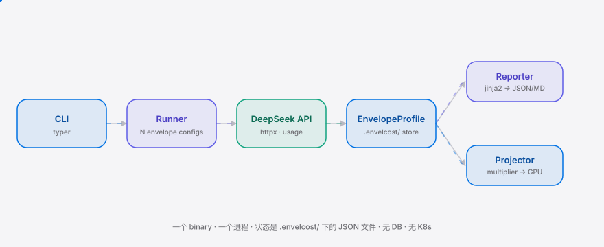

**English** | [简体中文](./README.md)

<div align="right"><sub><b>EN</b>&nbsp;&nbsp;⇄&nbsp;&nbsp;<a href="./README.md">中文</a></sub></div>

<p align="center">
  <picture>
    <source media="(prefers-color-scheme: dark)" srcset="./assets/hero-dark.svg">
    <source media="(prefers-color-scheme: light)" srcset="./assets/hero-light.svg">
    
  </picture>
</p>

<p align="center"><sub>A CLI that turns the 4x token-cost variance of the same DeepSeek V4 across coding-agent harnesses into a capacity number for 信创 on-prem GPU clusters.</sub></p>

<p align="center">
  <a href="./LICENSE"></a>
  <a href="https://github.com/SuperMarioYL/envelcost/releases"></a>
  <a href="https://github.com/SuperMarioYL/envelcost/actions/workflows/ci.yml"></a>
  
</p>

<p align="center"><strong>Same DeepSeek V4, but Claude Code / OpenCode / Pi burn 4x different tokens for the same diff — envelcost turns that variance into how many seats your H100 rack can actually serve.</strong></p>

---

## Contents

- [Architecture](#architecture)
- [Why this exists](#why-this-exists)
- [Install](#install)
- [Quickstart](#quickstart)
- [Usage](#usage)
- [Demo](#demo)
- [Configuration](#configuration)
- [Pricing](#pricing)
- [Roadmap](#roadmap)
- [License](#license)

<h2> Architecture</h2>

<p align="center">
  <picture>
    <source media="(prefers-color-scheme: dark)" srcset="./assets/atlas-dark.svg">
    <source media="(prefers-color-scheme: light)" srcset="./assets/atlas-light.svg">
    
  </picture>
</p>

One binary, one process, no DB. State is a set of JSON files under `.envelcost/`. The `Runner` replays a fixed set of coding tasks through N envelope configs against DeepSeek, captures per-request usage into `EnvelopeProfile` records on disk; the `Reporter` renders a per-envelope token table, and the `Projector` turns the measured multiplier into GPU seat-capacity. No microservices, no Kubernetes — if it needs more than three processes, scope it down.

<h2> Why this exists</h2>

A 信创 enterprise ML-platform engineer standardizing internal coding agents on DeepSeek V4 Flash today cannot capacity-plan a fixed on-prem GPU cluster from the model alone: the same model in Claude Code (via CLIProxyAPI), OpenCode, and Pi produces quality-equal diffs but burns 2–5x different tokens — a community benchmark measured Claude-Code-wrapped-DeepSeek at ~4x slower than the fastest harness. Under 数据不出境 the cluster cannot elastic-grow to absorb the worst-case harness, so **the harness envelope — not the model — becomes the hard throughput constraint**. Ops has no instrument that says, for a given internal-dev fleet size, how many H200s each harness choice implies. envelcost turns that ~4x variance into a per-harness token-cost projection the GPU budget can be sized against.

The new named primitive is `EnvelopeProfile` — a typed record that isolates the token cost attributable to the tool-call *envelope* (the schema scaffolding a harness wraps around every DeepSeek request) from the model's intrinsic token cost. The `envelope_overhead_tokens` field is exactly the cost driver the community benchmark could see but could not isolate; it is a layer none of the five already-shipped DeepSeek/cost tools (tokensched / dscache / cachepin / tokenctl / agentfuse) touch — they all operate *within* a single harness's budget/cache, while `EnvelopeProfile` compares *across* harness envelopes.

<h2> Install</h2>

```bash
# Pure Python, single command
uv tool install envelcost        # or: pipx install envelcost
# From source: uv pip install -e .
```

Requires Python ≥ 3.12. The core `run` / `project` path **needs no network and no DeepSeek API key** — the envelope cost is computed by offline tokenization of the actual serialized envelope text and is fully reproducible. Optionally `pip install -e ".[deepseek]"` to pull in transformers for the real DeepSeek-native BPE absolute token counts (the offline fallback is already enough to reproduce the >2x variance).

<h2> Quickstart</h2>

```bash
envelcost run                                    # replay 5 tasks x 2 envelopes, assert the >2x variance gate
envelcost project --gpus 8xH100 --seats 50       # read multipliers, project seat-capacity + cost/seat
envelcost report                                 # print the per-envelope token table, write .envelcost/envelcost-report.{json,md}
```

<details><summary>Sample output</summary>

```
task_id              harness                input overhead   mult
-------------------------------------------------------------------
swe-bench-mini-001   deepseek-native         3238        0  1.00x
swe-bench-mini-001   openai-shape            9102     5864  2.81x
...
m1 variance gate: 5/5 tasks above 2.0x (done bar PASSED); kill floor (1.5x) HELD

cluster: 8×NVIDIA H100 80GB  target seats: 50  total capex: ¥2,080,000
harness              mult   raw   eff   fits  deficit      ¥/seat   ¥/seat/yr
deepseek-native     1.00x    64    64    yes      -14 ¥    32,500 ¥   10,833
openai-shape        2.89x    64    22     NO      +28 ¥    94,545 ¥   31,515
on 8×H100 / 50 seats: deepseek-native fits, openai-shape does NOT fit
```

</details>

Total user effort to first value: under 5 minutes, each step under 60 seconds.

<h2> Usage</h2>

Three subcommands map to the m1/m2/m3 milestones. Full CLI reference: `envelcost --help`.

```bash
# 1) Full 3-envelope sweep (incl. Claude Code via CLIProxyAPI, strictly heavier than openai-shape)
envelcost run --harnesses deepseek-native,openai-shape,claude-code-cliproxy

# 2) Capacity planning: an H200 rack, 80 seats — see which harness does not fit
envelcost project --gpus 4xH200 --seats 80

# 3) Online mode (optional, schema_unverified): fill output_tokens from real DeepSeek usage
export DEEPSEEK_API_KEY=...
envelcost run --online
```

`envelcost project` reads the measured multipliers from `.envelcost/profiles.jsonl`; if you have not `run` yet, the projection falls back to parity (1.0x) and still runs. More examples in [`examples/quickstart.sh`](./examples/quickstart.sh).

<h2> Demo</h2>


The tape lives at [`docs/demo.tape`](./docs/demo.tape) and is re-rendered on demand by [`.github/workflows/demo.yml`](./.github/workflows/demo.yml). Run locally: `vhs docs/demo.tape` (needs vhs + ttyd + ffmpeg).

<h2> Configuration</h2>

Top-level CLI keys:

| Flag | Type | Default | Meaning |
|---|---|---|---|
| `--task` | str | `swe-bench-mini` | benchmark task set id |
| `--harnesses` | csv | `deepseek-native,openai-shape` | envelope configs to replay (comma-separated) |
| `--gpus` | spec | `8xH100` | GPU cluster spec, e.g. `4xH200` / `2xH3` |
| `--seats` | int | `50` | target concurrent coding-agent seats |
| `--store` | path | `.envelcost/` | store directory override |
| `--online` | flag | off | replay via the DeepSeek API (needs `DEEPSEEK_API_KEY`) |

Envelope configs (`envelcost/envelope.py`): `deepseek-native` (baseline 1.0x, compact inline protocol), `openai-shape` (OpenAI function-calling envelope, verbose JSON tools array re-sent every turn), `claude-code-cliproxy` (Claude Code via CLIProxyAPI, strictly heavier than openai-shape).

GPU catalog (`envelcost/config.py`, 信创 on-prem racks in stock):

| GPU | effective tokens/s/seat | unit capex (¥, ex-VAT) | unit power |
|---|---:|---:|---:|
| H100 80GB | 3200 | 260,000 | 700W |
| H200 141GB | 3600 | 300,000 | 700W |
| H3 288GB | 5200 | 420,000 | 1000W |

<h2> Pricing</h2>

The OSS core (benchmark + `EnvelopeProfile` + the `envelcost project` projection) is **self-hosted free** (MIT). Not a "free forever" promise — a self-hostable, 数据不出境-friendly credibility anchor.

Paid = **enterprise on-prem license**: extends the m3 projector with multi-cluster `EnvelopeProfile` aggregation + 信创 compliance export (for the 国产化 officer) + quota alerts + 1 year of support. The shape fits "self-hosted free + paid enterprise tier" — because 数据不出境 rules out pure SaaS hosting, license + on-prem is the 信创 default.

| Tier | Form | Price (educated guess) | For whom |
|---|---|---|---|
| OSS core | self-hosted, MIT | free | any 信创 ML-platform engineer who wants to reproduce the 4x variance and plan single-cluster capacity |
| Enterprise license | on-prem, multi-cluster aggregation + compliance export + alerts + support | **¥48,000/year per cluster** (~¥1,200/seat/year incremental) | 信创 ML-platform teams already standardized on DeepSeek V4 + a fixed on-prem cluster + 数据不出境 |
| Self-serve SaaS tier (non-信创, cloud-API devs outer ring) | hosted | ¥1,990/month (not the v0.1 main path) | cloud-API cost-optimization teams |

**Minimum "this is my card / wire-transfer" path:** a design-partner runs `envelcost run` + `envelcost project` once for free to get an `EnvelopeProfile` report + capacity recommendation (OSS free) → they want "3 clusters aggregated + compliance export for the officer" which is exactly the paid tier → upgrade to enterprise license → first wire transfer ~¥48,000/year with a 增值税专票 (信创 enterprises pay by corporate wire transfer + VAT invoice, not Stripe).

<h2> Roadmap</h2>

- [x] **m1 — reproduce variance**: reproducible 5-task × 2-envelope benchmark, >2x variance confirmed on ≥3/5 tasks (kill gate: <1.5x → halt & abandon). **Done**: current run shows 5/5 tasks at 2.83–3.27x.
- [ ] **m2 — ship envelope report**: 3 envelope configs + full `EnvelopeProfile` JSON+MD output + the bilingual README polish (README.md zh + README.en.md).
- [ ] **m3 — project GPU budget**: `envelcost project` already runs; extend with a multi-cluster aggregation preview (the enterprise-license hook).
- [ ] Future: non-DeepSeek models (Qwen / Kimi / GLM), general function-calling envelopes, IDE plugins (VS Code / JetBrains) — all deferred per the v0.1 out-of-scope.

**Kill criteria (falsifiable, not "ship forever"):** (1) m1 benchmark cross-envelope variance <1.5x → core thesis falsified, halt; (2) 30-day Gitee+GitHub <20 stars and zero design-partner inquiries → kill; (3) Claude Code / OpenCode / Pi ship native DeepSeek tool-call support so the envelope converges toward 1x → kill within two quarters.

<h2> License</h2>

MIT, see [`LICENSE`](./LICENSE). Found a bug or want to add a harness config? Open an [issue](https://github.com/SuperMarioYL/envelcost/issues) or a PR — a reproducible-benchmark gist against a real DeepSeek V4 endpoint is especially welcome.

<p align="center"><sub><a href="./LICENSE">MIT</a> © 2026 SuperMarioYL</sub></p>
